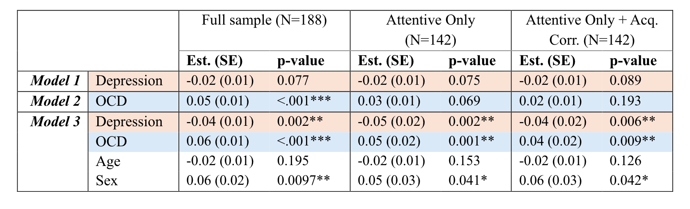
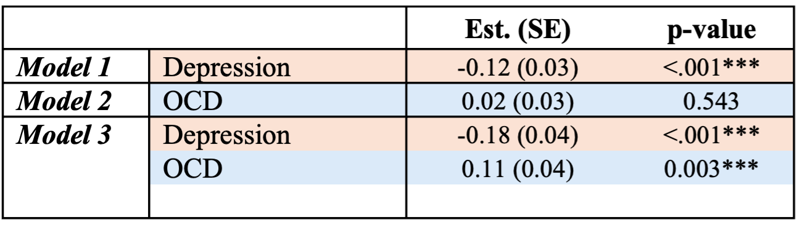
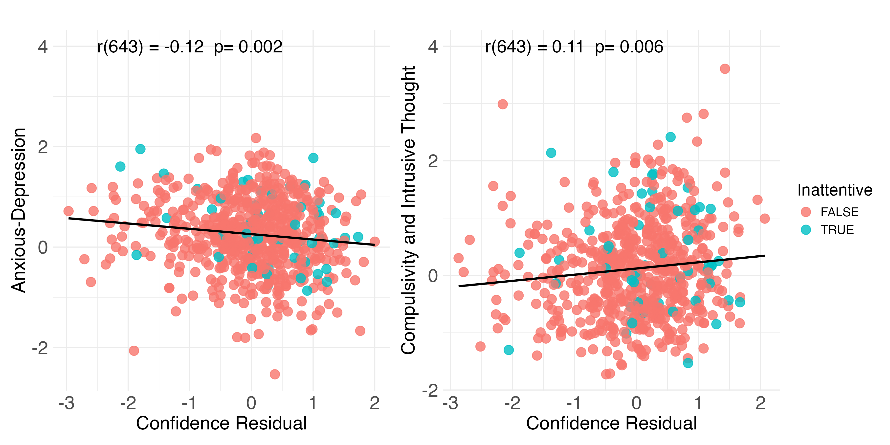
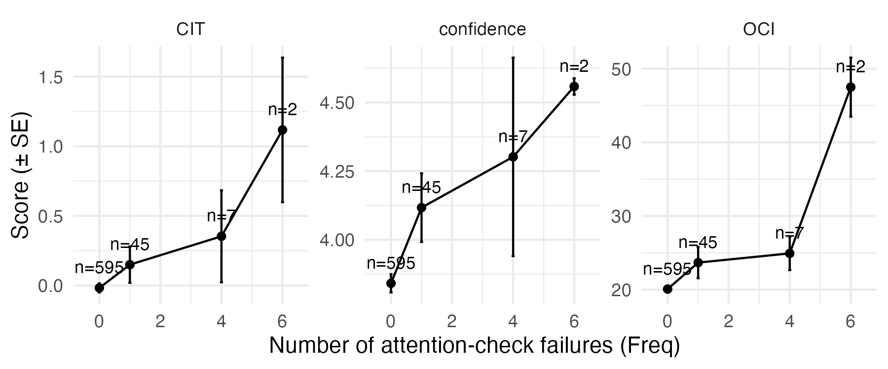
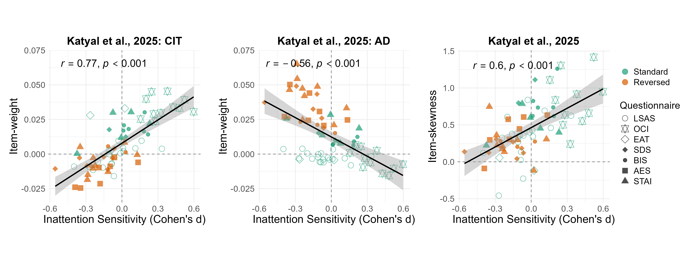

```{r setup, include=FALSE}
# details on packages versions is available under the Reproducibility section. 
library(ggplot2)
library(dplyr)
library(gridExtra)
library(tidyverse)
library(papaja)
library(osfr)
library(effectsize)
library(patchwork)
library(purrr)
library(ggrepel)
library(moments)
library(ggpubr)

# Load data files from the OSF repository - https://osf.io/75vc2/
# Skip OSF retrieval if files already downloaded
if (!dir.exists("Data")) {
  # retreive data from Gillan et al., OSF respository 
  osf_proj <- osf_retrieve_node("75vc2")
  
  folders <- osf_ls_files(osf_proj, type = "folder")
  # pick only the Data folder
  data_folder <- folders[folders$name == "Data", ]
  
  # download contents once; subsequent runs skip existing files
  osf_download(data_folder, path = ".", recurse = TRUE, conflicts = "skip")
}
```

In a reply to our recent preprint [@sarna2025], @gillan-reply criticize several aspects of our analysis approach. Specifically, they criticize the low statistical power of our experiment, our use of single questionnaires instead of their CIT and AD dimensions, over interpretation of post-hoc measures and the omission of covariates from our analysis. They further show that, in a new dataset of unpaid volunteers, a correlation between compulsivity and confidence persists even when excluding inattentive participants. We address each of these points in turn.

## 1. The inclusion of covariates can produce spurious associations

```{r covariates-analysis, message=FALSE, warning=FALSE, include=FALSE}
source("Code/6sarnareanalysisfull.R")
# the model numbers, m2-m3, correspond to those in Gillan et al. Table 1. 
m2 <- summary(lm(mean_conf~scale(total_oci_corrected_scaled), data=sub_df_oci_sds_acq)) 
# m2 output produces the same estimate and p-value as in Gillan et al. Table 1 model 2 (rightmost column) 
m3 <- summary(lm(mean_conf~scale(total_oci_corrected_scaled) + scale(total_sds_corrected_scaled)+scale(as.numeric(Age))+Sex, data=sub_df_oci_sds_acq)) 
# m3 out put produces the same estimate and p-value as in Gillan et al. Table 1 model 3 (rightmost column)
# control for age and sex only doesn't change the OCI-R coefficient 
m4 <- summary(lm(mean_conf~scale(total_oci_corrected_scaled) + scale(as.numeric(Age))+Sex, data=sub_df_oci_sds_acq )) 
# control for SDS only produces significant OCI-R coefficient
m5 <- summary(lm(mean_conf~scale(total_oci_corrected_scaled) + scale(total_sds_corrected_scaled), data=sub_df_oci_sds_acq)) 
```

Gillan et al. argue that our failure to find a positive correlation between the OCI-R score and confidence when excluding inattentive responders and controlling for acquiescence is due to not including sex, gender, and SDS scores in our statistical model. Specifically, they write:

> To illustrate the importance of including these well-established confounds, we added these covariates in a re-analysis of their data and recovered the often-reported significant negative association between depression and confidence that Sarna et al. fail to observe. Importantly, we also find that removing inattentive responders does not in fact reduce the associations between confidence and either the depression or OCD symptoms, in contrast to what they report (Table 1), with both OCD symptoms (p=.001) and depression (p=.002) remaining significantly and bidirectionally linked to confidence. The association between confidence and OCD, when controlling for depressive scores, age and gender, also remains significant even after correcting for acquiescence (p=.009).

They show (Table 1) that the OCI-R coefficient is nonsignificant when excluding inattentive participants and controlling for acquiescence (`r apa_print(m2)$full_result$scaletotal_oci_corrected_scaled`), but becomes significant when including age, sex and SDS scores in the model (`r apa_print(m3)$full_result$scaletotal_oci_corrected_scaled`).

```{r gillan-table, echo=FALSE, fig.cap="Table 1 - from Gillan et al., (2025). Original table note: Re-analysis of Sarna et al. (2025). Models 1 and 2 are used by Sarna et al. (2025). Model 3 includes covariates for co-occurring mental health symptoms and demographics (age and sex) variables. “Acq. Corr.” refers to acquiescence correction of clinical scores using the mean neutral rating. Two participants without sex data are removed."}

```

It is worth highlighting that the increase in predictive value of OCI-R is *solely* due to the inclusion of the SDS regressor, not the sex and age ones. When omitting SDS from the model the OCI-R coefficient remains unchanged (`r apa_print(m4)$full_result$scaletotal_oci_corrected_scaled`), but a model that includes only SDS as a covariate produces a significant OCI-R coefficient (`r apa_print(m5)$full_result$scaletotal_oci_corrected_scaled`).

Why does the inclusion of SDS in the model have this effect on the OCI-R coefficient? One interpretation is that the negative correlation between anxiety/depression and confidence masks a positive correlation between obsessive-compulsiveness and confidence. If obsessive-compulsive individuals tend to be more anxious, or depressed, than their peers (indeed, the correlation between SDS and OCI-R scores in our sample was `r apa_print(cor.test(sub_df_oci_sds_acq$total_oci_corrected,sub_df_oci_sds_acq$total_sds_corrected))$full_result` when excluding inattentive responders and controlling for acquiescence), it is conceivable that the positive correlation between OCI-R and confidence is suppressed by a stronger negative effect of anxiety and depression. But an alternative is that OCD and confidence are uncorrelated, but the strong correlation between the OCI-R and SDS regressors artificially creates opposite effects on confidence. This is sometimes referred to as "conditioning on a collider" [@rohrer2018; @wysocki2022; @lewer2025].

```{r simulation, include=TRUE}
set.seed(1)
# Latent variables 
pp = rnorm(1000,mean=0,sd=1);
depression = rnorm(1000,mean=0,sd=1)
OC = rnorm(1000,mean=0,sd=1)
confidence = rnorm(1000,mean=0, sd=1)

# Observed variables 
observed_confidence = confidence-0.2*depression;
OCI_R = pp+OC;
SDS = pp+depression

m1_sim <- summary(lm(observed_confidence~scale(SDS))) 
m2_sim <- summary(lm(observed_confidence~scale(OCI_R))) 
m5_sim <- summary(lm(observed_confidence~scale(OCI_R)+scale(SDS))) 
```

Consider the following simulation in which individual subjects are described by four independently and identically distributed numbers: an index of general psychopathology ($psychopathology\sim \mathcal{N}(0, 1)$), depression ($depression\sim \mathcal{N}(0, 1)$), obsessive-compulsive tendencies ($OC\sim \mathcal{N}(0, 1)$), and confidence ($confidence\sim \mathcal{N}(0, 1)$). In our simplified model, perceptual confidence negatively weighs depression, but is uncorrelated with obsessive compulsive tendencies ($measuredconfidence=confidence-0.2\times depression$). OCI-R (corrected for acquiescence, and excluding inattentive responders) is defined to be a linear combination of psychopathology and compulsivity ($OCIR=psychopathology+OC$). SDS (corrected for acquiescence, and excluding inattentive responders) is defined to be a linear combination of psychopathology and depression ($SDS=psychopathology+sadness$).

Analysing the data of 1000 simulated participants, a linear model that predicts confidence from SDS (similar to m1 in Gillan et al.) correctly infers that SDS and confidence are negatively related (`r apa_print(m1_sim)$full_result$scaleSDS`; Table 2- Model 1). Similarly, a linear model that predicts confidence from OCI-R (similar to Gillan et al., Table 1- Model 2) correctly infers that OCI-R and confidence are independent (`r apa_print(m2_sim)$full_result$scaleOCI_R`; Table 2- Model 2). And yet, when including both in the same model (like in their Model 3), both SDS and OCI-R appear as if they contribute to confidence, with opposite effects (SDS: `r apa_print(m5_sim)$full_result$scaleSDS`, OCI-R: `r apa_print(m5_sim)$full_result$scaleOCI_R`; Table 2- Model 3). To reiterarte: this model was designed such that OCI-R and confidence are independent, but controlling for SDS makes them appear correlated.

```{r simulation-plot, echo=FALSE, fig.cap="Table 2 - Results of a simulation in which OCI-R and confidence are designed to be independent, yet they appear correlated in Model 3 due to a collider bias. Linear models predicting confidence from simulated OCI-R and SDS scores."}

```

```{r, echo=FALSE, include=FALSE}
m1_acq <- summary(lm(scale(mean_rating)~scale(total_sds), data=df_complete))
m2_acq <- summary(lm(scale(mean_rating)~scale(total_oci), data=df_complete))
m3_acq <- summary(lm(scale(mean_rating)~scale(total_oci)+scale(total_sds), data=df_complete))
```

A similar effect can be observed in our raw data, before correcting for acquiescence effects and excluding inattentive participants. Since the OCI-R questionnaire has no reversed items, it is highly correlated with acquiescence. So, a linear model that predicts our proxy of acquiescence (mean rating to content-neutral items) from OCI-R scores reveals a positive relationship (`r apa_print(m2_acq)$full_result$scaletotal_oci`). The inclusion of reversed items in the SDS makes SDS total scores independent of acquiescence, and indeed a linear model that predicts mean neutral ratings from SDS total scores reveals no relationship (`r apa_print(m1_acq)$full_result$scaletotal_sds`). Critically, however, when including both in the same model, the positive relationship with the OCI-R slightly strengthens (`r apa_print(m3_acq)$full_result$scaletotal_oci`) and, more dramatically, SDS now appears to correlate with acquiescence (`r apa_print(m3_acq)$full_result$scaletotal_sds`). Together, while the inclusion of two highly correlated regressors does change the nature of the inferences, it is very difficult to tell whether this change reflect the uncovering of a true association or the emergence of a spurious one. For this reason, for the purpose of our paper, focusing on raw correlations seemed more appropriate.

## 2. Fully controlling for covariates is hard

A central claim made by Gillan et al. in their reply is that even when inattentive responding is well-controlled, the bidirectional association between the AD and CIT dimensions and confidence persists. To support this, they show data from @fox2023, which included multiple attention checks to identify inattentive responders, yet still observed a significant association between CIT and confidence with no significant differences between attentive and inattentive participants (Figure 1). They interpret this as evidence that the effect is not driven by inattention. However, whether this finding truly challenges the response bias interpretation depends on the extent to which such datasets can be considered fully controlled for inattention and acquiescence.

```{r pips-fig, echo=FALSE, fig.cap="Figure 1 - from Gillan et al., (2025). Original figure note: Inattentive responding (in blue) has no impact on the associations between confidence and mental health dimensions in a large clinical sample from Fox et al. (2023). Confidence Residual refers to confidence scores residualised for age and gender and AD/CIT."}

```

Consistent with inattention remaining only partly controlled, Fox et al. (2023) reported only 8% of participants as inattentive, a rate much lower than the 24% detected in our data and below the inattention rates reported by Zorowitz et al. (2023; 22% in general and in clinical samples). These lower rates likely reflect the way inattention was assessed---using only instructed-response items (e.g., "If you are paying attention to these questions, please select x") rather than infrequency items, which are recommended as the gold standard [@zorowitz2023; @chandler2020]. Instructed-response items have been shown to be poor measure of inattention [@hauser2016; @barends2019]. As a result, Fox et al. 2023 likely underestimated the true rate of inattentive responding in their sample, and the reported association between CIT and confidence is therefore still confounded by undetected inattention. This interpretation is consistent with the finding that inattentive participants in their data show the same pattern we report: higher levels of CIT, OCI-R, and confidence (Figure 2).

```{r pips-inattention-fig, echo=FALSE, warning=FALSE, message=FALSE, fig.cap="Figure 2 - Inattentive participants in Fox et al., 2023 show elevated CIT, confidence, and OCI-R scores."}

# Clear all
rm(list = ls())

list_inattentives = read_csv('Data/PIPS_OSF_89xzq/inattentive_antidep_over0.csv') %>%
  rbind(read_csv('Data/PIPS_OSF_89xzq/inattentive_antidep_over1.csv')) %>%
  rbind(read_csv('Data/PIPS_OSF_89xzq/inattentive_cbt_over0.csv')) %>%
  rbind(read_csv('Data/PIPS_OSF_89xzq/inattentive_cbt_over1.csv')) %>%
  rbind(read_csv('Data/PIPS_OSF_89xzq/inattentive_control_over0.csv')) %>%
  rbind(read_csv('Data/PIPS_OSF_89xzq/inattentive_control_over1.csv')) %>%
  rename(subj_id=Var1) %>%
  group_by(subj_id) %>%
  summarise(Freq=sum(Freq))

all_cbt_data = read_csv('Data/PIPS_OSF_89xzq/allData_cbt_osf.csv') %>%
  rename(subj_id=ID_short)%>%
  left_join(list_inattentives, by = "subj_id") %>%
  replace_na(list(Freq = 0))

summary_cbt <- all_cbt_data %>%
  group_by(Freq,subj_id)%>%
  summarise(confidence_subj=mean(mean_confidence),
            OCI_subj=mean(OCI_total),
            CIT_subj=mean(CIT))%>%
  group_by(Freq) %>%
  summarise(confidence=mean(confidence_subj),
            se_confidence=sd(confidence_subj)/sqrt(length(confidence_subj)),
            OCI = mean(OCI_subj),
            se_OCI = sd(OCI_subj)/sqrt(length(OCI_subj)),
            CIT=mean(CIT_subj),
            se_CIT = sd(CIT_subj)/sqrt(length(CIT_subj)),
            n=length(confidence_subj))

summary_cbt_long <- summary_cbt %>%
  pivot_longer(cols = c(confidence, OCI, CIT), names_to = "measure", values_to = "mean") %>%
  pivot_longer(cols = c(se_confidence, se_OCI, se_CIT), names_to = "se_type", values_to = "se") %>%
  filter(str_detect(se_type, measure))  # match SE to corresponding measure

# Plot
summary_cbt<- 
  ggplot(summary_cbt_long, aes(x = Freq, y = mean, group = measure)) +
  geom_line() +
  geom_point() +
  geom_errorbar(aes(ymin = mean - se, ymax = mean + se), width = 0.1) +
  facet_wrap(~measure, scales = "free_y") +
  geom_text(aes(label = paste0("n=", n)), vjust = -1.2, size = 3) +
  theme_minimal() +
  labs(x = "Number of infrequency item failures (Freq)",
       y = "Score (± SE)")

#ggsave(summary_cbt, '../figures/summary_cbt.png',dpi=300,width=6,height=2.5)

```

In our experiment, which was designed to detect inattentive responding, we fitted a model that matched our data well and found that even with four infrequency items, only about 85% of inattentive participants could be identified (see @sarna2025 Appendix, Model estimation of inattentive responding). This aligns well with previous work showing that statistically controlling for confounding variables using self-report measures is inherently difficult, and full control is rarely achieved [@westfall2016]. The reason is that self-report measures are noisy and provide only imperfect estimates of the underlying latent construct that they are intended to measure: a fact that is true of both infrequency items as a measure of inattentive responding and of neutral items as an estimate of acquiescence.

```{r ES-response-bias, include=FALSE}
source("Code/sarna_short.R")
# correlation coefficients --------------------------------------------------
oci_corrected_conf_cor <- participants_level_df_att %>% 
  {cor.test(~ total_oci_corrected_scaled + mean_conf, data = .)}
# produces the same value as reported in Sarna et al. (2025): r = 0.1132617

acq_conf_cor <- participants_level_df %>% 
  {cor.test(~ mean_rating + mean_conf, data = .)}
# produces the same value as reported in Sarna et al. (2025): r = 0.3043725

# regression models --------------------------------------------------
# model predicting confidence from corrected OCI-R
# data includes only attentive participants 
m_corrected_oci <- summary(lm(mean_conf ~ total_oci_corrected_scaled, data = participants_level_df_att))

# models predicting confidence from response bias
# data includes all participants 
m_acq <- summary(lm(mean_conf ~ mean_rating, data = participants_level_df))
m_acq_inatt <- summary(lm(mean_conf ~ mean_rating + failed_attention, data = participants_level_df))

# calculating r squared ratios --------------------------------------------------
acq_over_oci <- round(m_acq$r.squared/m_corrected_oci$r.squared, 0)
acq_inatt_over_oci <- round(m_acq_inatt$r.squared/m_corrected_oci$r.squared, 0)
```

```{r power-analysis, include=FALSE}
# power analysis --------------------------------------------------
# OCI-R confidence correlation
# power analysis 80% to detect this correlation - 
oci_corrected_conf_cor_power <-
pwr::pwr.r.test(r = oci_corrected_conf_cor$estimate, power = 0.8, sig.level = 0.05, alternative = "two.sided")

# Acquiescence confidence correlation
# power analysis 80% to detect this correlation - 
acq_conf_cor_power <-
pwr::pwr.r.test(r = acq_conf_cor$estimate, power = 0.80, sig.level = 0.05, alternative = "two.sided")

# Inattentive vs attentive confidence comparison
inattentive_confidence_d <- cohens_d(
  mean_conf ~ failed_attention,
  data = participants_level_df
)

# power analysis 80% to detect this effect size -
inattentive_confidence_power <-
pwr::pwr.t.test(
  d = inattentive_confidence_d$Cohens_d,
  power = 0.80,
  sig.level = 0.05,
  type = "two.sample",
  alternative = "two.sided"
)
```

Beyond being difficult to fully control, both acquiescence and inattentive responding exert substantial influence on the variables of interest. In our data, the correlation between OCI-R and confidence, after controlling for inattention and acquiescence is `r apa_print(oci_corrected_conf_cor)$estimate`, similar to the value reported by Gillan et al., (2025; n = 645), whereas the correlation between acquiescence and confidence is `r apa_print(acq_conf_cor)$estimate`. A model predicting confidence from acquiescence alone (`r apa_print(m_acq)$estimate$modelfit$r2`) accounts for roughly `r print_num(acq_over_oci)` times more variance in confidence than a model with the corrected OCI-R scores (`r apa_print(m_corrected_oci)$estimate$modelfit$r2`). A model that includes both our inattention and acquiescence measures as regressors predicting confidence explains `r apa_print(m_acq_inatt)$estimate$modelfit$r2` of the variance. This is roughly `r print_num(acq_inatt_over_oci)` times the variance explained by the corrected OCI-R in our data (`r apa_print(m_corrected_oci)$estimate$modelfit$r2`).

Admittedly, these comparisons are not straightforward, as the variance explained by the OCI-R is calculated after excluding inattentive participants, whereas the variance explained by surface-level questionnaire-filling behaviours is calculated with inattentive participants included (as the effects of inattention are of interest). And still, according to these estimates, to achieve 80% power to detect the correlation between OCI-R and confidence (controlling for inattention and acquiescence), one needs a sample of more than 600 participants, but to detect the correlation between confidence and acquiescence with the same power, a sample of `r apa_num(acq_conf_cor_power$n, digits=0)` participants is sufficient, and to find an effect of inattentive responding in a between-group comparison, it is sufficient to have `r apa_num(inattentive_confidence_power$n, digits=0)` participants per group. The relative magnitude of these required sample sizes is informative: it means that one needs to be very certain that all effects of acquiescence and inattentive responding are controlled for before concluding that a significant correlation between OCI-R and confidence is driven by more than undetected surface-level questionnaire-filling behaviours.

Taken together, given that the confounds we identified have effect sizes much larger than the effect of interest, and that full control for these confounds is not feasible, even a significant CIT--confidence correlation cannot rule out the possibility that these relationships are fully accounted for by the confounds. As Westfall & Yarkoni (2016) notes "the larger the influence of the confounding covariate, the more variance can be misattributed to the predictor of interest, leading to an increase in Type I error."

## 3. Low statistical power

@gillan-reply suggested that our sample size (n = 190) was insufficient to detect a significant compulsivity--confidence correlation. First, we wish to clarify that our intention was *not* to interpret our null finding as evidence of absence of compulsivity-confidence correlation. Our main focus (as pre-registered: [10.17605/OSF.IO/JDQUY](https://doi.org/10.17605/OSF.IO/JDQUY)) was to test the magnitude of effects from surface-level questionnaire filling behaviours. This was quantified as correlations between questionnaire scores, mean confidence ratings, and our proxies of acquiescence and inattention, and as the relative drop in the OCI-R-confidence correlation when controlling for these confounds, not the final size of the correlation, as we explain in the Results section:

> Readers should not over-interpret the nonsignificance of the final correlation, but instead focus on the magnitude of the drop in the correlation coefficient (from .27 to .11), which, as we show in the Appendix, was highly significant, and cannot be explained by the reduction in the sample size (excluding inattentive participants) nor by the correction procedure (regressing out the mean response to neutral items).

Our sample was highly sensitive and well-powered to detect these huge effects. As we note in the previous section, even if the OCI-R-confidence correlation had remained significant after controlling for inattention and acquiescence, given the very modest (r\^2=0.01) magnitude of the effect of interest relative to the large effect sizes of surface-level questionnaire-filling behaviour, and given that our measures of these confounds, advanced as they are, are never perfect, this would not count as firm evidence for a true correlation between confidence and obsessive compulsive tendencies.

We wish to end this section by noting the broader implication of increasing sample size when a confounding variable is measured unreliably. As Westfall and Yarkoni (2016) clearly explain:

> ... as sample size increases, error rates also increase. It is worth reflecting on this result, because it contravenes the received wisdom that larger samples mitigate most common statistical problems (e.g., as n grows, power to reject the null increases, parameter estimates become more precise, etc.). Indeed, we find that for studies involving thousands of participants and non-negligible indirect effects, rejection of the null hypothesis is a near certainty even when the null is in fact true [...] the reason for this behavior becomes clear: as samples grow, power to detect any reliable association between the predictors and the outcome necessarily increases. This remains true even when measurement unreliability causes the model to confuse a common effect of two or more predictors with a unique effect of one predictor---as n grows, the model more confidently concludes that there is a reliable association between the predictor of interest and the outcome.

## 4. The use of single questionnaires instead of CIT and AD dimensions

Gillan et al. argue that our findings based on the OCI-R cannot be generalized to the CIT dimension, as these capture different constructs. They rightly point out that the OCI-R reflects clinical OCD symptoms, while CIT represents a broader, transdiagnostic factor that includes compulsivity, among other related traits. Accordingly, they suggest that our conclusions rely on a false equivalence between these measures.

We therefore wish to make clear that it is not our claim that the OCI-R is equivalent to the CIT factor or that the SDS is equivalent to the AD dimension. Rather, our central point concerns the *ubiquity of response biases* in self-report measures commonly used in computational psychiatry and their effects of correlations with decision confidence, irrespective of their theoretical labeling. The psychometric features that render the OCI-R particularly vulnerable to response biases (its high positive skew and the absence of reversed-coded items) are shared by the items that constitute the CIT dimension. Because CIT is computed from multiple highly skewed items, and because it systematically undoes the semantic reversal of reversed-coded items by assigning them a negative weight, the mechanisms we identify are expected to operate similarly, if not more strongly. Consequently, the extent to which the OCI-R and CIT reflect identical clinical constructs is independent of our methodological concern: both are susceptible to the same forms of response bias.

As an argument for the robustness of the CIT-confidence effect, Gillan et al. emphasize that it has been repeatedly replicated across multiple datasets and studies. Yet replicating an effect across studies that share similar methodological vulnerabilities does not establish its validity as long as the same confounds are consistently operating. As such, repeated statistical significance cannot rule out the possibility that the CIT--confidence association, as currently observed, remains partly or wholly driven by residual response bias rather than genuine metacognitive effects. Unless demonstrated otherwise, we believe that the parsimonious assumption is that the same vulnerabilities apply across these instruments.

## 5. Skew is a feature, and also a bug

```{r katyal-analysis, include=FALSE}
source("./Code/katyal.exp2.R")
```

Gillan et al. acknowledge that surface-level properties such as skewness and item coding are important and understudied, but argue that our assertions about their contribution to the transdiagnostic dimensions are not supported by data. Their claim is that skewness primarily reflects the underlying prevalence of symptoms: some mental health problems are common (e.g., depression and anxiety), while others are rare (e.g., compulsivity). Therefore, the association between skewness and CIT weights is expected.

We agree that skewness is not randomly assigned and that some symptoms are indeed rarer than others. In this sense, skewness is a feature of certain psychopathological constructs. However, skewness also has a bug component: rare response patterns are particularly vulnerable to inflation by inattentive responding.

Indeed, although skewness is a post-hoc measure and not designed to assess inattention, it aligns closely with inattention in practice. To show this, we reanalyzed data from @katyal2025, which include a reliable inattention index based on infrequency items. For each psychiatric questionnaire item, we computed its sensitivity to inattention by comparing the difference in item endorsement between inattentive and attentive respondents (using Cohen's d to obtain a standardized effect size). If skewness is a sensitive index of inattention, items with higher skewness should show larger inattentive--attentive differences. This is exactly what we found: inattention sensitivity was strongly associated with item-level skewness (`r apa_print(katyal_inattention_skewness_cor)$full_result`, Figure 3, right panel). We also tested the correlation between CIT and AD factor weights and inattention sensitivity, and found the same patterns obtained for skewness: inattention sensitivity positively correlated with CIT weights (`r apa_print(katyal_inattention_CIT_cor)$full_result`, Figure 3, left panel), and a negatively correlated with AD weights (`r apa_print(katyal_inattention_AD_cor)$full_result`, Figure 3, left panel). In other words, items that received higher ratings from inattentive participants loaded high on CIT and low on AD, and the opposite was true for items that received lower ratings from inattentive participants. This validates our use of skewness as a proxy for inattention sensitivity, and reaffirms that the factor structure strongly aligns with inattentive responding.

```{r katyal-figure, echo=FALSE, fig.cap="**Figure 3** - Item sensitivity to inattention is correlated with both CIT/AD item weights and item-level skewness in Katyal et al., (2025). Each point represents a questionnaire item, with point shapes indicating the questionnaire and color coding for standard versus reversed items. The x-axis shows each item’s sensitivity to inattentive responding (Cohen’s d, comparing inattentive vs. attentive participants). Left panel: the y-axis shows the CIT item-weight. Middle panel: the y-axis shows the AD item-weight. Right panel: the y-axis shows item-level skewness. The solid black line represents the linear regression fit, and the shaded region reflects the standard error of the fit. The reported correlation is the Spearman correlation coefficient."}

```

```{r repro-error, include=FALSE}
source("Code/sarna_short.R")
# Correlation between confidence and OCI-R / SDS scores in V1
oci_conf_cor_v1 <-
  participants_level_df_repro_errors %>%
  filter(failed_attention == "Attentive") %>%
  {cor.test(~ mean_conf + total_oci_corrected_scaled, data = .)}

sds_conf_cor_v1 <-
  participants_level_df_repro_errors %>%
  filter(failed_attention == "Attentive") %>%
  {cor.test(~ mean_conf + total_sds_corrected_scaled, data = .)}

# Correlation between confidence and OCI-R / SDS scores in V2 (corrected for acquiescence including only attentive participants)
oci_conf_cor_v2 <-
  participants_level_df_att %>%
  {cor.test(~ mean_conf + total_oci_corrected_scaled, data = .)}

sds_conf_cor_v2 <-
  participants_level_df_att %>%
  {cor.test(~ mean_conf + total_sds_corrected_scaled, data = .)}

# OCI correlatio drop in V1 vs. V2
oci_conf_cor <-
  participants_level_df_repro_errors %>% 
  {cor.test(~ mean_conf + total_oci, data = .)}

drop_in_V1 <- round(oci_conf_cor$estimate - oci_conf_cor_v1$estimate, 2)
drop_in_V2 <- round(oci_conf_cor$estimate - oci_conf_cor_v2$estimate, 2)

```

## 6. Additional clarifications

@gillan-reply also noted two analysis errors found in earlier versions of our preprint. First, in the acquiescence correction procedure for the SDS questionnaire, the residualized scores were misaligned with participant IDs. Second, in the acquiescence correction procedure for both the OCI-R and the SDS, the model predicting item ratings from the mean response to neutral items included inattentive responders who should have been excluded prior to the correction. We are grateful to Gillan et al. for identifying these errors. Both issues have been corrected in the current version of the preprint and, importantly, had no effect on the pattern of results or their interpretation. These corrections had only minor influence on some descriptive values, detailed below:

1.  In the main text Results section, under "Inattentiveness and acquiescence are associated with shifts in confidence ratings," the correlation between the OCI-R (excluding inattentive responders and controlling for acquiescence) changed from `r apa_print(oci_conf_cor_v1)$full_result` to `r apa_print(oci_conf_cor_v2)$full_result`. Additionally, the correlation between the SDS (excluding inattentive responders and controlling for acquiescence) changed from `r apa_print(sds_conf_cor_v1)$full_result` to `r apa_print(sds_conf_cor_v2)$full_result`.

2.  In the Appendix, under "A bootstrap permutation test for response style effects on OCI-confidence correlations," the small change in the OCI-R correlation mentioned above also altered the drop in correlation after controlling for acquiescence from `r print_num(drop_in_V1)` to `r print_num(drop_in_V2)`.

## 7. What we still don't know

We believe our work convincingly demonstrates the ubiquity of response biases in online samples, their sizable effects on correlations between self-reported mental health and confidence ratings, and the difficulty to fully control for these effects. We also think these results cast many previous findings in a different light, raising questions about their interpretability. Importantly, we do not claim that all correlations between self-reported mental health and confidence ratings are spurious, or are "explained away". It is however the case that more work is needed to determine which findings are fully explained by these biases and which are only partially accounted for. For instance, when considering the diverging metacognitive patterns between individuals with high compulsive tendencies and those with clinical OCD [@hoven2023], we acknowledge that while some important pieces of this puzzle were uncovered by our original paper, others remain unresolved. In particular, we still do not know why online studies do not show a negative correlation between OC tendencies and confidence, as would be expected from the centrality of self-doubt in OCD phenomenology. We note that this tension is not resolved by the difference between obsessive compulsive tendencies (as measured with the OCI-R questionnaire) and compulsivity (as reflected in the CIT dimension). In our study, we find a positive correlation between OCI-R and confidence, which does not become negative when removing inattentive participants and controlling for acquiescence. Additional possibilities that will need to be examined in future work concern the testing environment (online vs. in-person), the cognitive domain (memory vs. perception), and the relevance of these variables to OCD phenomenology [see also the Discussion in @sarna2024]. We leave it for future work to fully disentangle the OCD--compulsivity paradox.

## Reproducibility

### Data availability

Data is available on OSF at <https://osf.io/75vc2/>.

### Code availability

Our fully reproducible analysis code is available on GitHub at <https://github.com/self-model/BIRDAM>.

### **R package versions**

```{r session-info, echo=FALSE}
installed.packages()[names(sessionInfo()$otherPkgs), "Version"]
```

-   \newpage

# Acknowledgements

We thank Julia Rohrer for her help in making sense of the surprising effects of including correlated covariates.

# References

::: {#refs custom-style="Bibliography"}
:::
